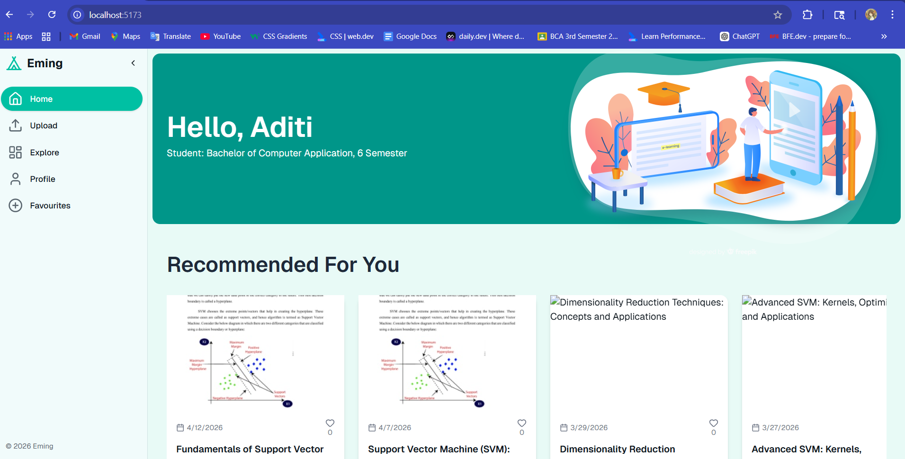
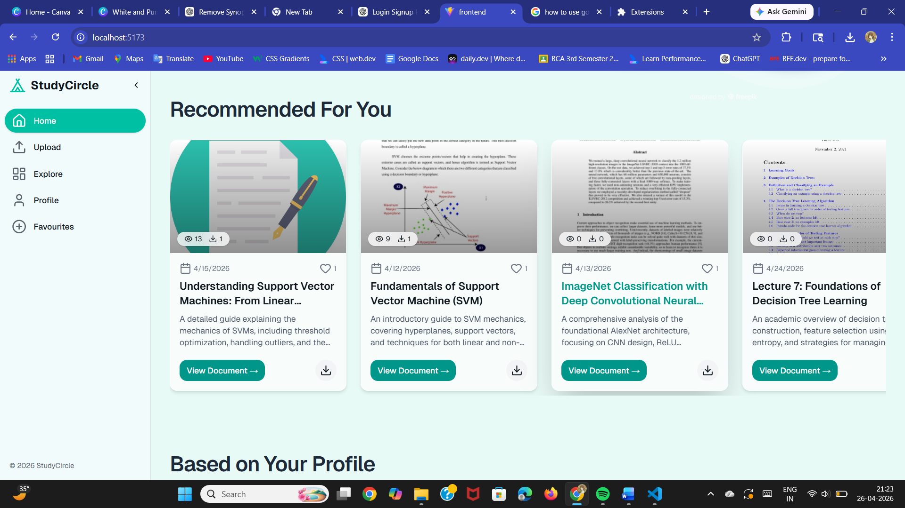
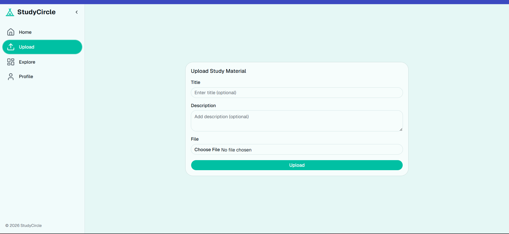
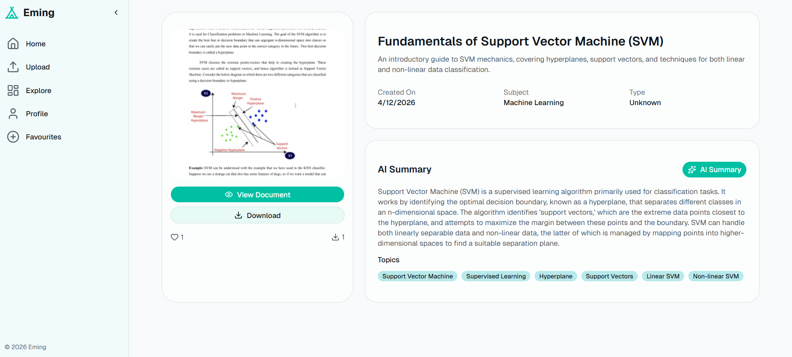
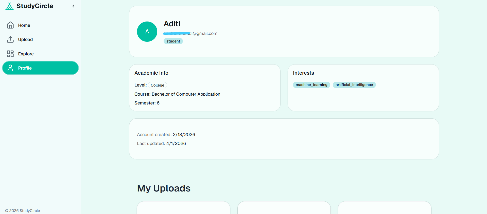
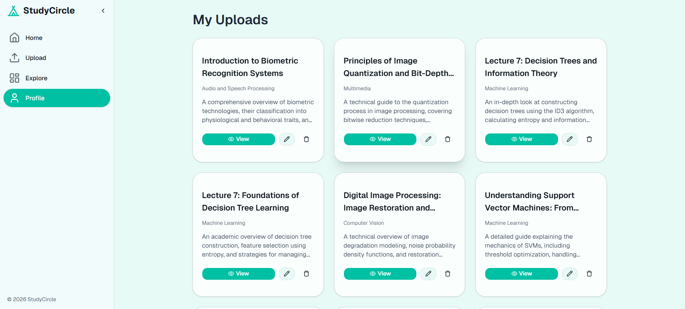
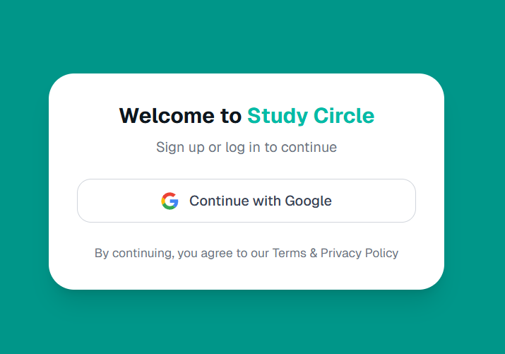
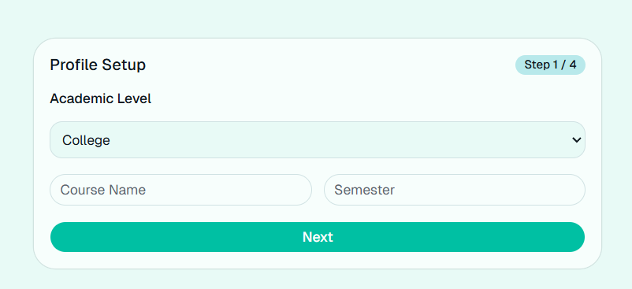
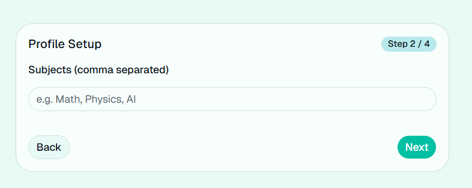

A smart web application for sharing and organizing study materials with AI-powered document analysis and summarization.

FEATURES  
* Upload and share study materials
* ML-based subject classification for uploaded documents
* AI-generated summaries using Gemini API
* Automatic topic extraction from documents
* Secure user authentication with Firebase
* Cloud-based storage and access

 TECH STACK 
 Frontend: React.js, Tailwind CSS
 
 Backend: FastAPI 
 
 Database: MongoDB 
 
 Storage: Cloudinary for storing documents
 
 Model Training: Lightining AI 
 
 Authentication: Firebase 

 AI & ML 
Subject Classification Model: It works on NLP, feature extraction like TF-IDF, and supervised classification algorithm (Naive Bayes in this case) to predict the subject based on text patterns

##Screenshots 

###Homepage

 

###UploadPage 

 

###View Document Page 

 

###ProfilePage 

 

###Create Profile 

GeminiAPI: Used for analysing the uploaded document and provide quick summary. 
 

 
